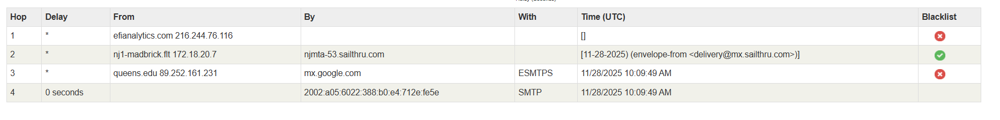

Opis phising maila: Vaš račun je bil blokiran! Vaše fotografije in videoposnetki bodo odstranjeni 28. 11. 2025. Ukrepajte!!

-Kakšen je dejanski IP pošiljatelja?
    Received: from queens.edu (dhjh.dhgate.com. [89.252.161.231])
    Lažno predstavljanje, da prihaja iz queens.edu, v resnici pa je 89.252.161.231.
-Ali se domena pošiljatelja ujema z naslovom v “From”?
    Ne. 
    Payment-Declined <nooreply@iua.dwehoviiexepj.us>
    v resnici pa: otupewoeutaet.holverson.org (oz. moxpfrlkolhnq@otupewoeutaet.holverson.org)
-Iz katere države približno izvira sporočilo?
    Iz Turčije (glede na https://whatismyipaddress.com/ip/89.252.161.231)
-So v headerju vidni znaki preusmeritev preko več strežnikov?
    Da. 
    
-So prisotne napake SPF/DKIM/DMARC?
    
    Da. Ni DKIM podpisa, ni zaisa DMARC (ni zaščite).

-Kako hitro opazite sumljivost e-poštnega sporočila? **
    Pogledamo naslov pošiljatelja (imei + domeno) in tipkarske napake v domeni, neujemanje ime - naslov. 
    Pazimo na zadevo : pretirana nujnost, izsiljevanje/grožnje (npr. ukinitev / izbris), finančne zahteve (zahteva po transakciji).
    Preverjanje povezav: URL ujemanje z domeno pošiljatelja in preusmeritve na tujo stran.
    Pazimo na slovnico, slog besedila; na kratko: primernost besedila glede na pošiljatelja, naslovnika in zadevo

-Bi z zagotovostjo lahko vsako sporočilo prepoznali kot nevarno brez headerja?
    Verjetno ne, saj header vsebuje ključne infomracije za identifikacijo "spam" sporočil, npr: originalni IP, verifikacijski znaki in 
    pot komunikacije. 
-Kaj bi svetovali nekomu, ki je nov uporabnik elektronske pošte glede nevarnosti, ki nanj prežijo iz vidika socialnega inženiringa?
    Paziti na naivnost, ime pošiljatelja, kritično presojo nad vsebino, ki je poslana in znake točke, ki sem jih opisal pri **.
